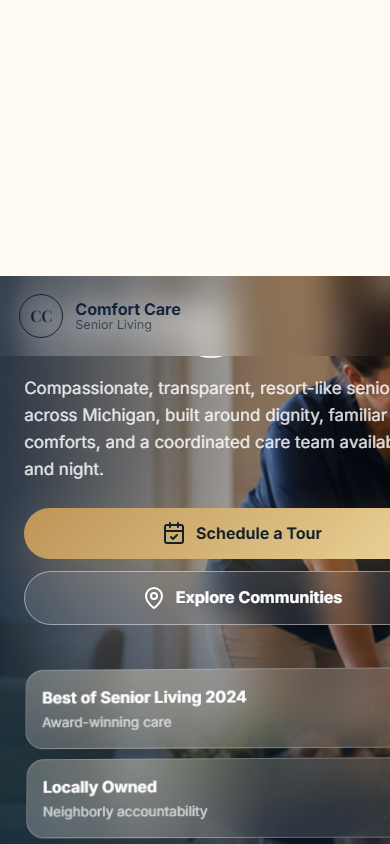

# Comfort Care Senior Living — Admissions Operations Platform

Production admissions and operations software for a senior-living operator spanning **13+ communities**. Replaces a generic CRM with purpose-built tooling: a deterministic next-action engine for every prospective resident, a live room board, and a move-in workflow, all backed by role- and location-scoped access and full activity logging.

**Live:** https://comfort-care-senior-living.vercel.app
**Stack:** Node.js · Supabase (Postgres) · Vercel serverless · vanilla JS front end

---

## What it does

- **Command center** — single operating view of every active case and what needs to happen next.
- **Operating-plan queue** — prioritized work list driven by a deterministic next-action engine, so no lead stalls silently.
- **Active case view** — full history, status, and contact timeline per prospective resident.
- **Room board with reservations** — live availability across communities; rooms can be held against a move-in.
- **Move-in workflow** — guided steps from reserved to admitted.
- **Revenue & occupancy risk panels** — surface at-risk occupancy and revenue exposure.
- **Public lead capture** — site forms write straight into the pipeline via Supabase-backed APIs.

## Engineering notes

- **Deterministic next-action engine** — every case resolves to one unambiguous next action from its state, rather than relying on a human to remember.
- **Role- and location-scoped access** — staff only see and act on the communities they own, enforced server-side (Supabase RLS + API checks).
- **Append-only activity logging** — every state change is recorded for audit.
- **Serverless API** under `api/` (`leads`, `v2`, `admin`, `health`) deployed on Vercel; schema and policies under `supabase/`.
- Hardened for production: modular admin front end (`public/admin-v2*`), a session-restore fix, and a browser QA / smoke-test pass before deploys.

## Screenshots




## Repo layout

```
api/        serverless endpoints (leads, v2, admin, health)
public/     admin console (admin-v2*), check-in + tablet forms, marketing site
supabase/   schema + row-level security policies
scripts/    operational tooling
server.js   local dev server
```

> Client name withheld at the operator's request; available on request.
